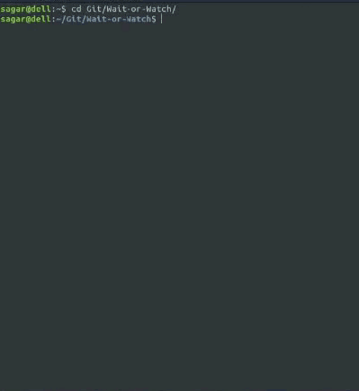
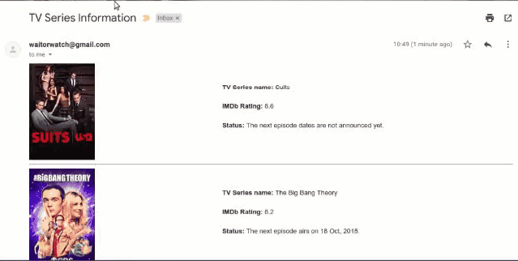

# Wait-or-Watch
Wait or Watch reminds you the release date of the next episode of your favorite TV Series

## Installation

- Clone this directory \
`git clone https://github.com/sagarp0810/Wait-or-Watch.git`

- Enter the directory \
`cd Wait-or-Watch`

- Install pip package \
`sudo apt-get install python-pip`

- Install the requirements \
`pip install -r requirements.txt`

## Usage
To run the script use the following command \
`python wow.py`

NOTE - Make sure your MySQL is configured with password="qwerty". If not you can change it the wow.py file with your password.

## Example

| Input | Output |
|:---:|:---:|
|  |  |
